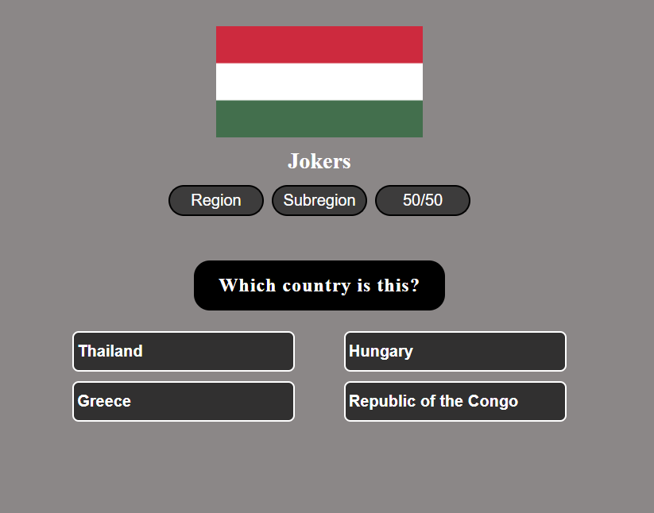

## Guess the country by its flag.



To get a local copy of the code, clone it using git:

```
git clone https://github.com/92gahov/Guess-The-Country
cd Guess-The-Country
```

Install dependencies:

```
npm install
```

Now, you can start a local web server by running:

```
npm start
```

### `Final result` <a href="https://guess-the-country.surge.sh/" target="_blank">here</a>